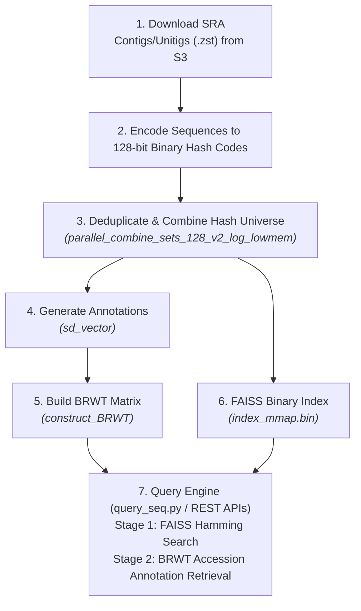

# Architecture & Data Flow

Meshmetal processes raw genomic sequences into searchable indexed representations via a multi-stage pipeline.

## End-to-End Data Flow

## Stage Descriptions

### Stage 1: Sequence Acquisition & Preprocessing
Raw contigs and unitigs stored as `.zst` files in Logan S3 buckets are downloaded and decompressed using multithreaded workers.

### Stage 2: Deep Metric Learning (DML) Encoding
Sequences are passed through a fine-tuned Transformer model. Subsequences are embedded into 128-bit binary vectors where Hamming distance directly corresponds to biological sequence similarity.

### Stage 3: Universe Deduplication & Combination
Per-sample binary embedding files are combined into a global deduplicated "hash universe". Memory-constrained environments use k-way merge disk-spilling sorting (`parallel_combine_sets_128_v2_log_lowmem`).

### Stage 4: Matrix Annotation Vector Generation
For each sample, a bit vector (`sd_vector`) is generated indicating which hashes from the universe appear in that sample.

### Stage 5: BRWT Compression
All sample bit vectors are combined into a compressed Binary Relation Wavelet Tree (BRWT). Arity relaxation reduces storage while maintaining rapid row/column lookup.

### Stage 6: Standalone FAISS Index Creation
The unique 128-bit hash universe is indexed into a custom `IndexBinaryHash` structure supporting 16-bit prefix buckets, memory mapping (`mmap`), and REST API endpoints.

### Stage 7: Two-Stage Query Retrieval
- **Stage 1 (FAISS)**: Query sequence embeddings are matched against the 128-bit hash index to retrieve candidate hash IDs within a specified Hamming distance radius.
- **Stage 2 (BRWT)**: Matched hash IDs are queried against the BRWT server to resolve the precise SRA run accession IDs and compute coverage metrics.
