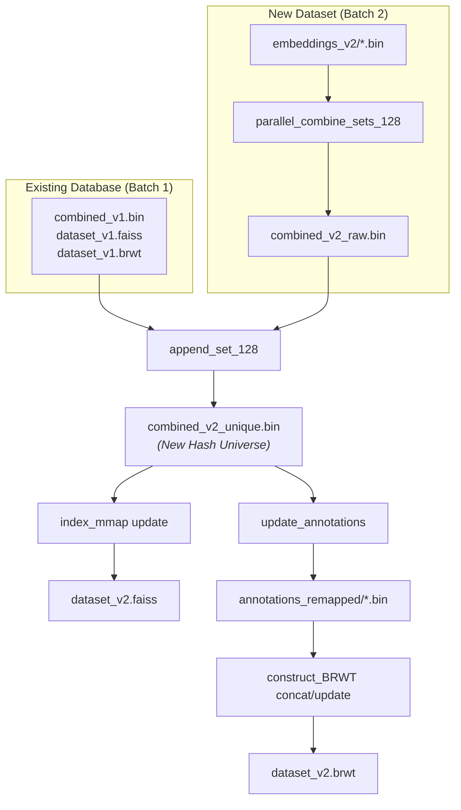

# Incremental Database Update

One of Meshmetal's core architectural advantages is the ability to **incrementally append new metagenomic datasets** without rebuilding existing indices from scratch.

## Incremental Workflow Overview

When adding a new batch of SRA samples (Batch 2) to an existing indexed database (Batch 1):



## Step-by-Step Procedure

### Step 1: Combine & Deduplicate New Batch
Run `parallel_combine_sets_128_v2_log_lowmem` on the new sample embedding files to produce `combined_v2_raw.bin`.

### Step 2: Merge Hash Universes (`append_set_128`)
Merge the existing universe (`combined_v1.bin`) and new batch universe (`combined_v2_raw.bin`) into a new deduplicated universe (`combined_v2_unique.bin`):

```bash
append_set_128 \
    combined_v1.bin \
    combined_v2_raw.bin \
    combined_v2_unique.bin
```

### Step 3: Incrementally Update FAISS Index (`index_mmap update`)
Append the new unique hashes to the existing FAISS index:

```bash
index_mmap update \
    dataset_v1.faiss \
    new_hashes_only.bin \
    0 \
    dataset_v2.faiss
```

### Step 4: Remap Annotations & Merge BRWT Trees
1. Use `update_annotations` to remap existing `sd_vector` annotation files from the old universe index space to the new universe index space:
   ```bash
   update_annotations \
       embedding_file_list.txt \
       combined_v1.bin \
       combined_v2_unique.bin \
       annotations_v1_dir \
       annotations_remapped_dir
   ```
2. Build `sd_vector` annotation vectors for the new Batch 2 samples against `combined_v2_unique.bin`.
3. Use `construct_BRWT update` or `construct_BRWT concat` to merge the BRWT trees:
   ```bash
   construct_BRWT update dataset_v1.brwt batch2_BRWT.brwt dataset_v2.brwt
   ```
