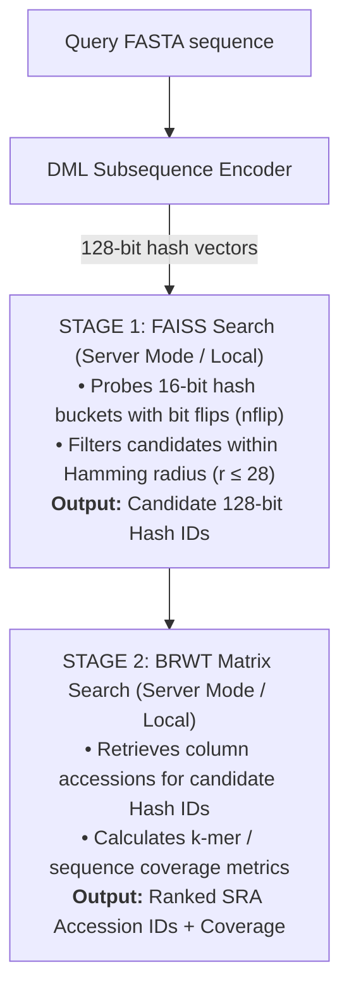

# Query Engine Overview

The Meshmetal query engine searches input sequence FASTA files against the database in a two-stage retrieval pipeline.

## Two-Stage Query Architecture

## Key Query Modes

1. **Persistent Server Mode (Recommended)**:
   - Hosts `faiss_server` on a user-specified port (loads or mmaps index once).
   - Hosts `construct_BRWT server` on a user-specified port.
   - `query_seq.py` queries servers over HTTP REST APIs.
2. **Local Direct Mode**:
   - `query_seq.py` loads the `.faiss` index and `.brwt` tree directly into local process memory.
